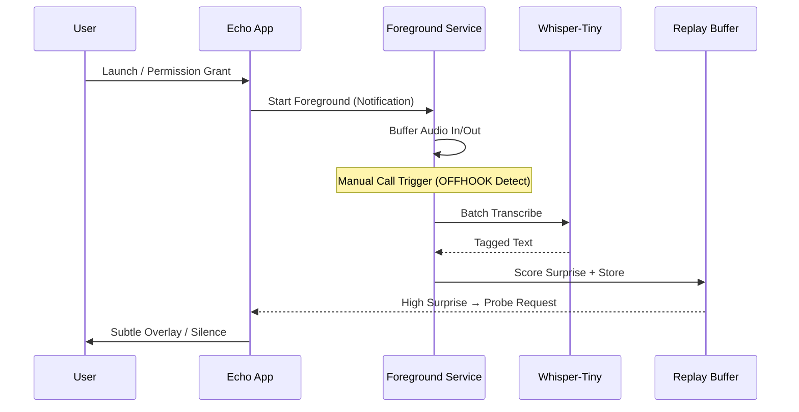

```mermaid
sequenceDiagram
    participant User
    participant App as Echo App
    participant Service as Foreground Service
    participant Transcriber as Whisper-Tiny
    participant Buffer as Replay Buffer

    User->>App: Launch / Permission Grant
    App->>Service: Start Foreground (Notification)
    Service->>Service: Buffer Audio In/Out
    Note over Service: Manual Call Trigger (OFFHOOK Detect)
    Service->>Transcriber: Batch Transcribe
    Transcriber-->>Service: Tagged Text
    Service->>Buffer: Score Surprise + Store
    Buffer-->>App: High Surprise → Probe Request
    App->>User: Subtle Overlay / Silence
```
