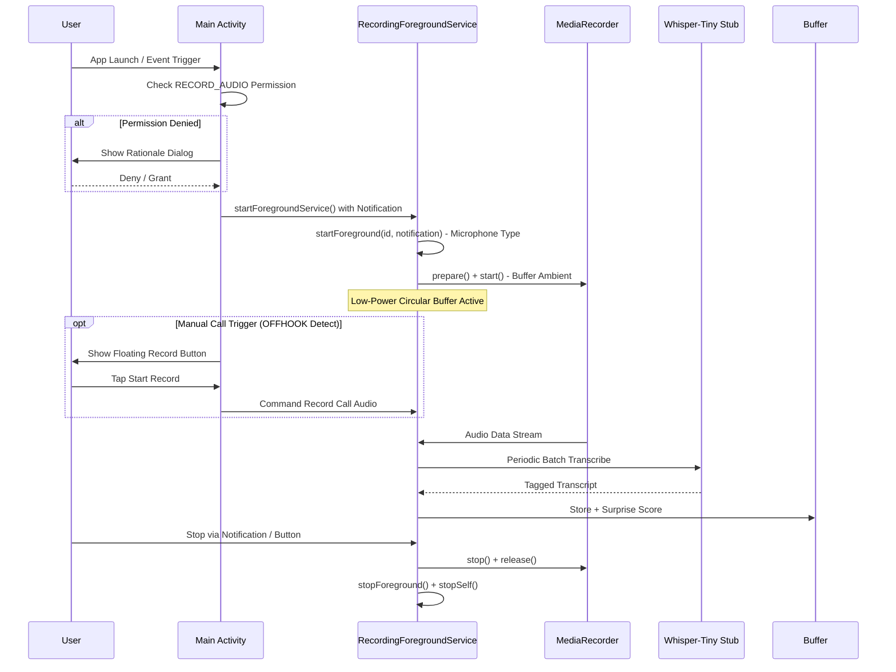

```mermaid
sequenceDiagram
    participant User
    participant Activity as Main Activity
    participant Service as RecordingForegroundService
    participant Recorder as MediaRecorder
    participant Transcriber as Whisper-Tiny Stub

    User->>Activity: App Launch / Event Trigger
    Activity->>Activity: Check RECORD_AUDIO Permission
    alt Permission Denied
        Activity->>User: Show Rationale Dialog
        User-->>Activity: Deny / Grant
    end
    Activity->>Service: startForegroundService() with Notification
    Service->>Service: startForeground(id, notification) - Microphone Type
    Service->>Recorder: prepare() + start() - Buffer Ambient
    Note over Service: Low-Power Circular Buffer Active
    opt Manual Call Trigger (OFFHOOK Detect)
        Activity->>User: Show Floating Record Button
        User->>Activity: Tap Start Record
        Activity->>Service: Command Record Call Audio
    end
    Recorder->>Service: Audio Data Stream
    Service->>Transcriber: Periodic Batch Transcribe
    Transcriber-->>Service: Tagged Transcript
    Service->>Buffer: Store + Surprise Score
    User->>Service: Stop via Notification / Button
    Service->>Recorder: stop() + release()
    Service->>Service: stopForeground() + stopSelf()
```
