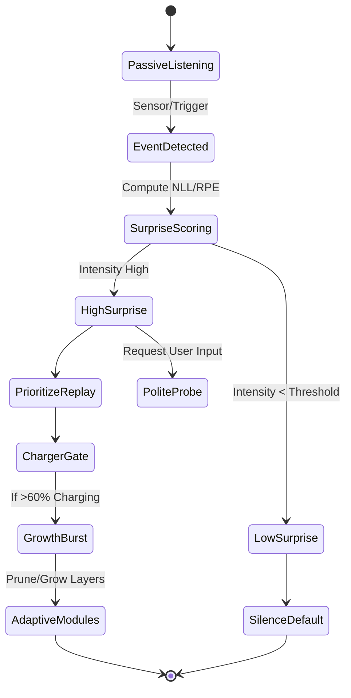

```mermaid
stateDiagram-v2
    [*] --> PassiveListening
    PassiveListening --> EventDetected: Sensor/Trigger
    EventDetected --> SurpriseScoring: Compute NLL/RPE
    SurpriseScoring --> LowSurprise: Intensity < Threshold
    LowSurprise --> SilenceDefault
    SurpriseScoring --> HighSurprise: Intensity High
    HighSurprise --> PrioritizeReplay
    HighSurprise --> PoliteProbe: Request User Input
    PrioritizeReplay --> ChargerGate
    ChargerGate --> GrowthBurst: If >60% Charging
    GrowthBurst --> AdaptiveModules: Prune/Grow Layers
    AdaptiveModules --> [*]
    SilenceDefault --> [*]
```
