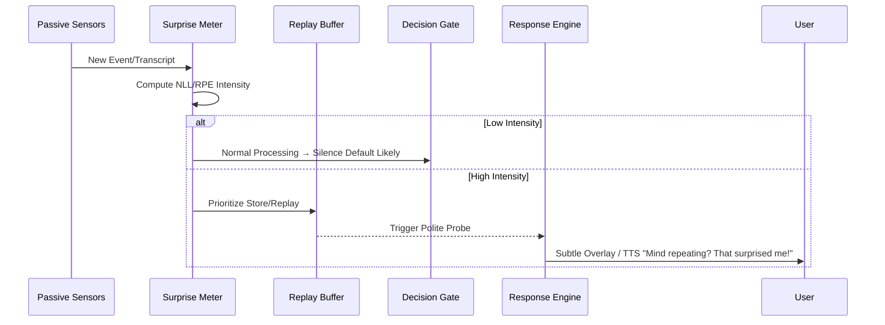

```mermaid
sequenceDiagram
    participant Sensor as Passive Sensors
    participant Meter as Surprise Meter
    participant Buffer as Replay Buffer
    participant Gate as Decision Gate
    participant Response as Response Engine

    Sensor->>Meter: New Event/Transcript
    Meter->>Meter: Compute NLL/RPE Intensity
    alt Low Intensity
        Meter->>Gate: Normal Processing → Silence Default Likely
    else High Intensity
        Meter->>Buffer: Prioritize Store/Replay
        Buffer-->>Response: Trigger Polite Probe
        Response->>User: Subtle Overlay / TTS "Mind repeating? That surprised me!"
    end
```
