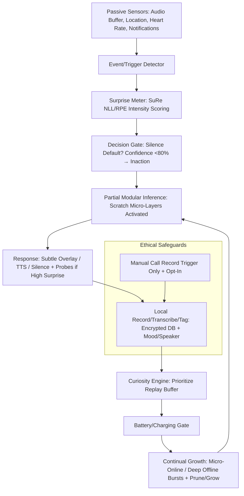

```mermaid
graph TD
    A[Passive Sensors: Audio Buffer, Location, Heart Rate, Notifications] --> B[Event/Trigger Detector]
    B --> C[Surprise Meter: SuRe NLL/RPE Intensity Scoring]
    C --> D[Decision Gate: Silence Default? Confidence <80% → Inaction]
    D --> E[Partial Modular Inference: Scratch Micro-Layers Activated]
    E --> F[Response: Subtle Overlay / TTS / Silence + Probes if High Surprise]
    F --> G[Local Record/Transcribe/Tag: Encrypted DB + Mood/Speaker]
    G --> H[Curiosity Engine: Prioritize Replay Buffer]
    H --> I[Battery/Charging Gate]
    I --> J[Continual Growth: Micro-Online / Deep Offline Bursts + Prune/Grow]
    J --> E
    subgraph Ethical Safeguards
        K[Manual Call Record Trigger Only + Opt-In] --> G
    end
```
