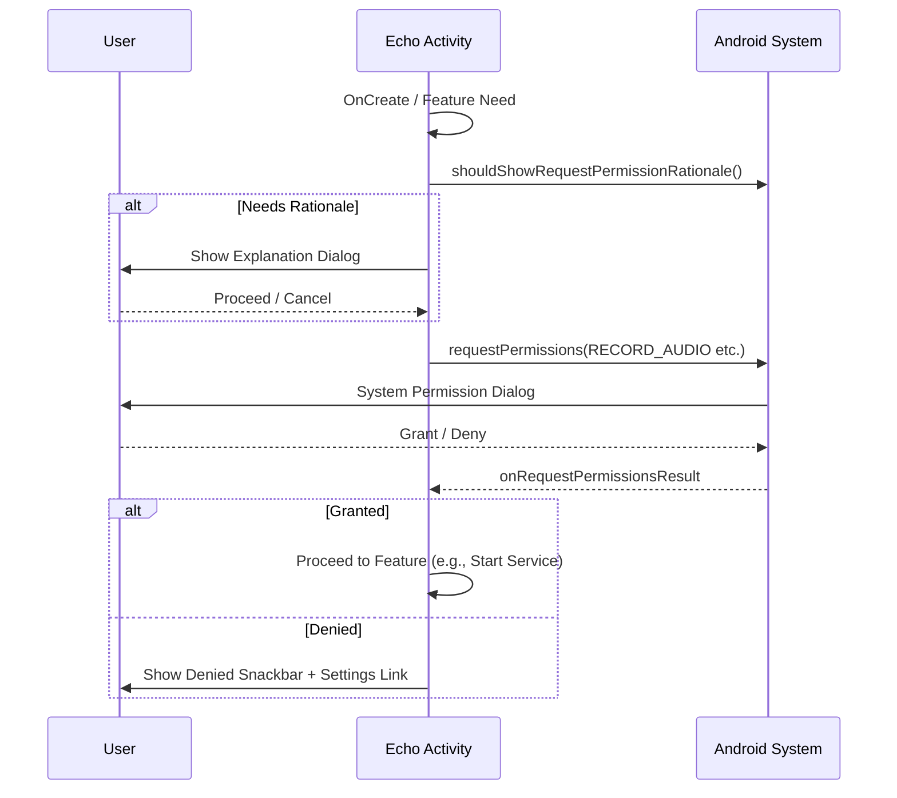

```mermaid
sequenceDiagram
    participant User
    participant Activity as Echo Activity
    participant System as Android System

    Activity->>Activity: OnCreate / Feature Need
    Activity->>System: shouldShowRequestPermissionRationale()
    alt Needs Rationale
        Activity->>User: Show Explanation Dialog
        User-->>Activity: Proceed / Cancel
    end
    Activity->>System: requestPermissions(RECORD_AUDIO etc.)
    System->>User: System Permission Dialog
    User-->>System: Grant / Deny
    System-->>Activity: onRequestPermissionsResult
    alt Granted
        Activity->>Activity: Proceed to Feature (e.g., Start Service)
    else Denied
        Activity->>User: Show Denied Snackbar + Settings Link
    end
```
